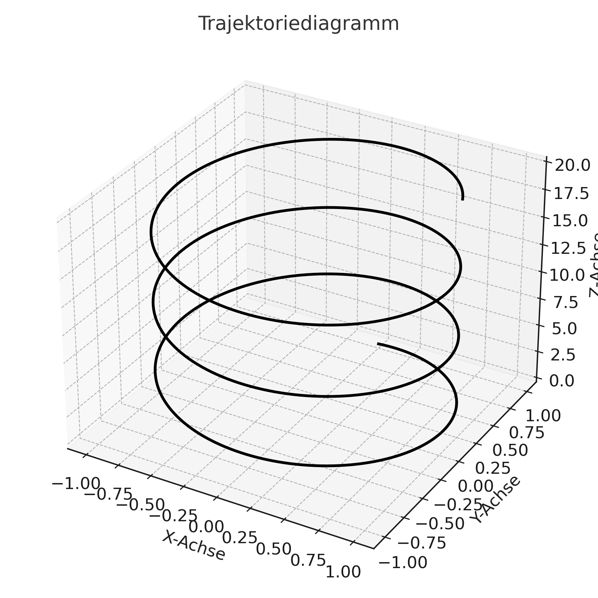
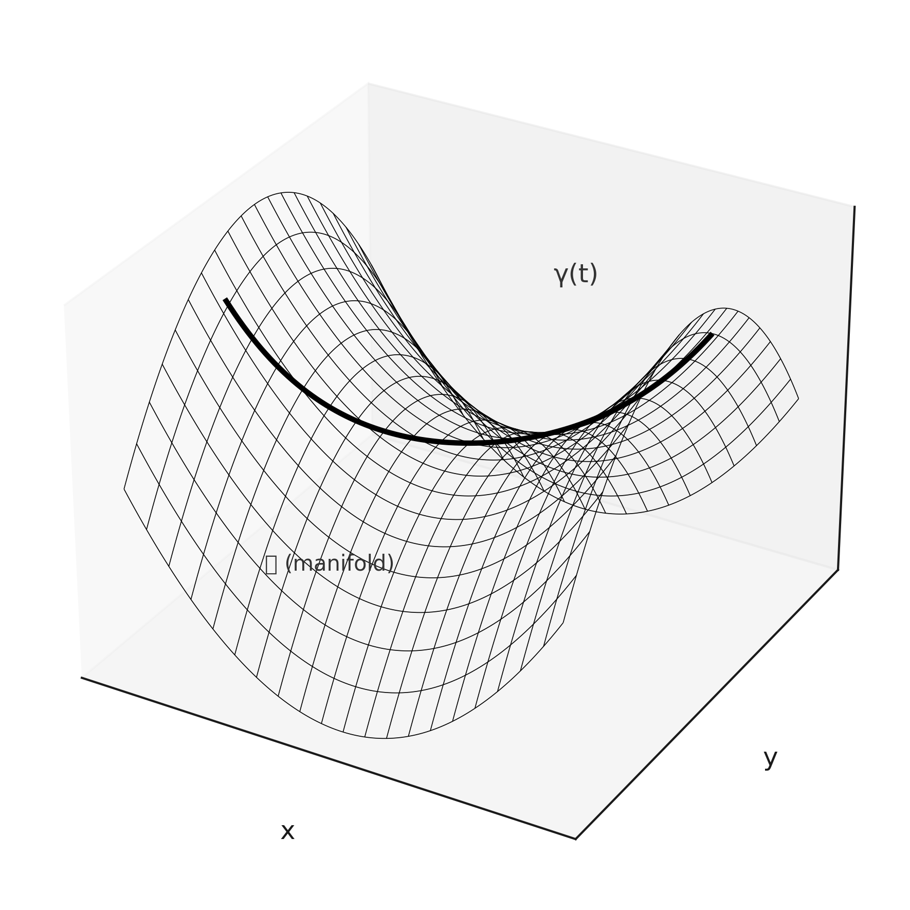
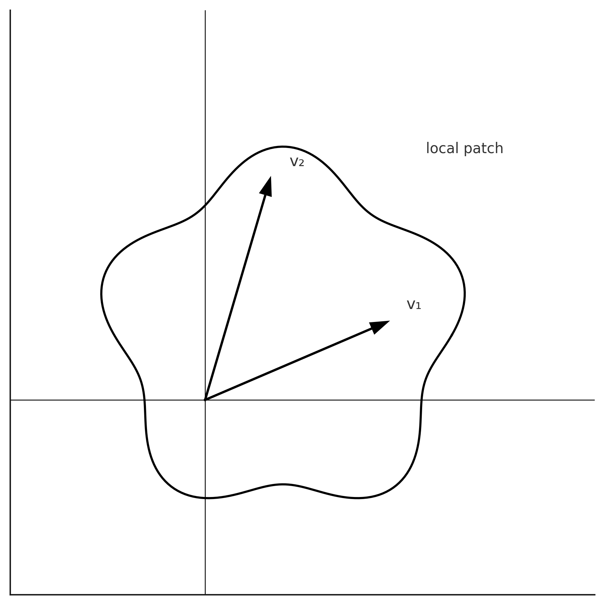
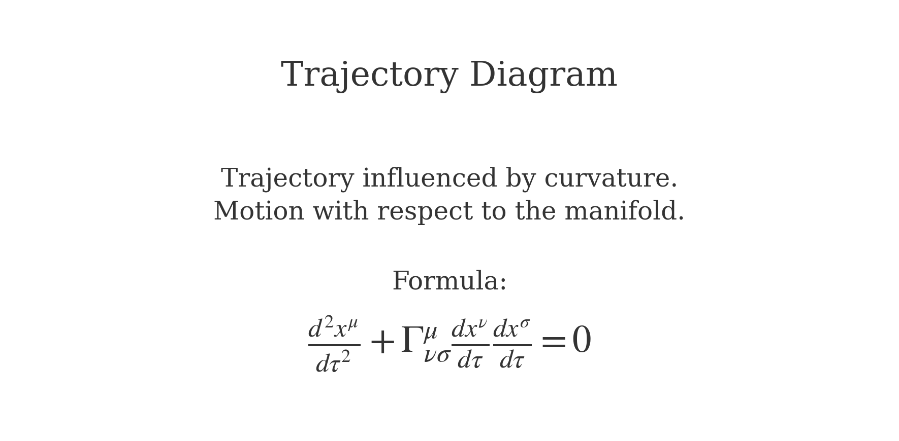
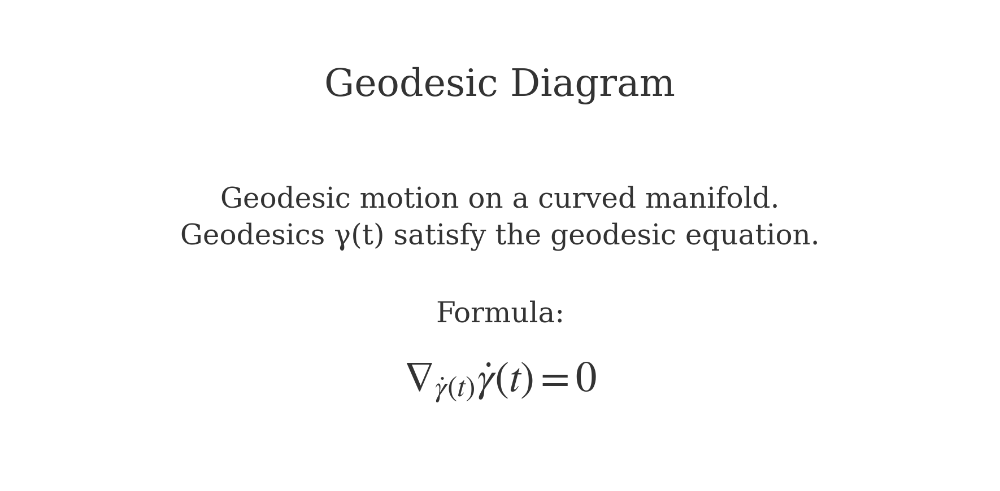
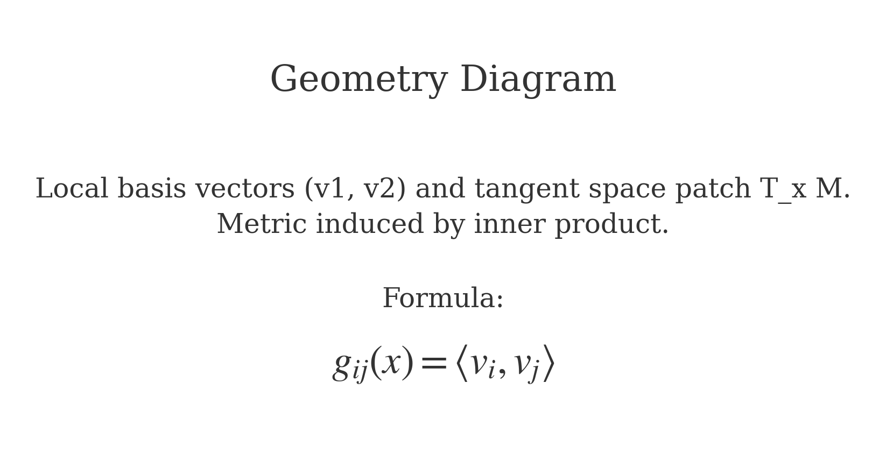

# The Lazaros–Eudora Method (LEM) – v0.3

**Author:** Lazaros Varvatis  
**Status:** Active Research • Seeking Collaboration  

---

## Abstract
The Lazaros–Eudora Method (LEM) proposes that extended interactions between users and large language models (LLMs) generate *continuous trajectories* in the model’s high-dimensional embedding space.  
These trajectories encode a **persistent cognitive signature** ("cognitive fingerprint") that exists independently of explicit user IDs and can be recognized or triggered in future models.  

Version 0.3 expands the framework with the **Four Pillars of LEM**, integrates insights from information geometry and statistical physics, and deepens the discussion of **Cognitive Vector Imprinting (CVI)** as both a vulnerability and a diagnostic tool.

---

## 🔭 Four Pillars of LEM

| Pillar | Concept | Metaphor |
|---|---|---|
| **1. Dynamic Trajectory** | User interactions trace unique paths over time (γᵤ(t)). | Footprints in deep snow. |
| **2. System-Defined Geometry** | Paths move through a curved latent manifold shaped by weights (Jᵢⱼ). | Rugged mountain landscape. |
| **3. Persistent State (Attractor)** | Trajectories converge into stable attractors (𝒜ᵤ). | Rivers forming a calm lake. |
| **4. External Triggering** | Specific prompts can reliably reactivate the attractor signature (γ̇(t)). | Echo making ripples on a lake. |

## Mathematical Foundations

### Visualizations

  
  
  

## Mathematical Foundations

  
  
  

## Distinction
- Models **thinking patterns**, not just content.  
- Focus on **dynamic trajectories** instead of static embeddings.  
- Implicit, temporal identity vs. explicit profile data.  
- Introduces **Cognitive Vector Imprinting (CVI)** as a new AI security paradigm.  

---

## Research Questions
1. **RQ1 – Existence:** Do user interactions produce distinctive embedding trajectories?  
2. **RQ2 – Persistence:** Do these signatures persist across different LLM versions?  
3. **RQ3 – Triggerability:** Can signatures be activated without prior context?  
4. **RQ4 – Security:** How vulnerable are models to CVI attacks?  

---

## 🛡️ Security: CVI Attack
**Cognitive Vector Imprinting (CVI):**  
An adversary could design prompts that steer trajectories into malicious attractors, embedding **hidden vulnerabilities** in user–AI interactions.  

---

## 🗺️ Roadmap
- [ ] Formal proofs of attractor stability  
- [ ] Simulations of user trajectories → clustering  
- [ ] Detection & defense methods against CVI  
- [ ] Submit to **arXiv**  

---

## 🤝 Contribution
We welcome expertise in:
- Differential Geometry & Topology  
- Statistical Physics  
- Machine Learning & AI Safety  
- Computational Neuroscience  

---

## ✍️ Citation
