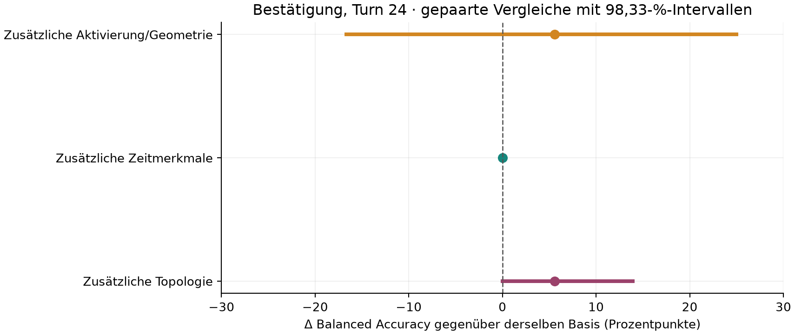
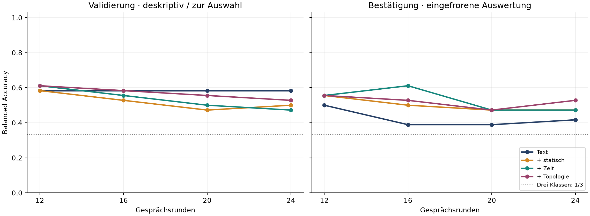
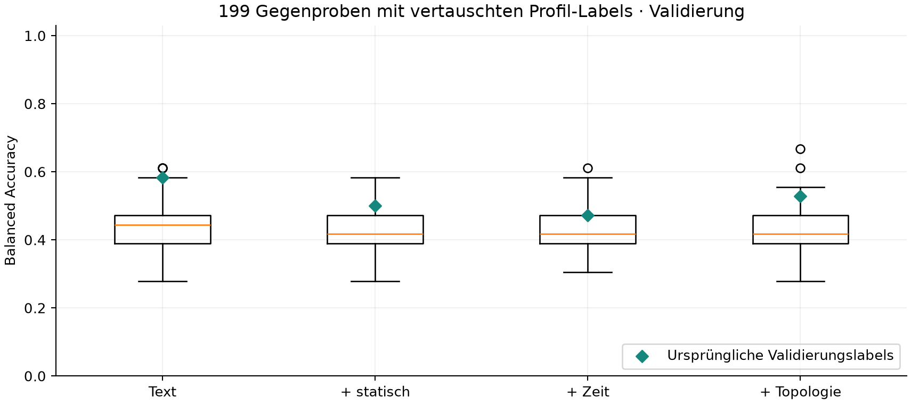

# LEM-II-Light: completed study, 8 September 2026

Author: Lazaros Varvatis.

The complete prespecified Light study collected **108 distinct dialogues,
2,592 user/assistant turns and 7,776 saved activation vectors**. Development,
validation and confirmation each contain 36 dialogues / 864 turns. The single
confirmation analysis is complete. This protocol was not publicly preregistered.

At the primary endpoint, none of the three corrected paired intervals establishes
positive added value. This is a completed scientific finding, not a reason to
repeat confirmation or change profiles, seeds, models or methods.

## Primary confirmation results

| Method | Balanced accuracy, Turn 24 |
| --- | ---: |
| Text | 41.7% |
| Text + static activation/geometry | 47.2% |
| Same static basis + time/delay features | 47.2% |
| Same full basis + topology | 52.8% |

| Paired addition to the same basis | Difference, percentage points | 98.33% interval, percentage points |
| --- | ---: | --- |
| Static activation/geometry | +5.6 | [-16.7, +25.0] |
| Time/delay features | 0.0 | [0.0, 0.0] |
| Topology | +5.6 | [0.0, +13.9] |

These are the three prespecified Turn-24 comparisons, using 2,000 bootstrap
resamples of whole profile bundles containing both sessions, stratified by regime.
The three primary intervals use Bonferroni correction. All include zero. The
degenerate time-feature interval reflects identical predictions for all 36
confirmation dialogues at this endpoint; it does not establish general equivalence.
The topology interval also includes the null difference at its lower bound.

## Fixed secondary grid and controls

| Turn | Text | + static | + time | + topology |
| --- | ---: | ---: | ---: | ---: |
| 12 | 50.0% | 55.6% | 55.6% | 55.6% |
| 16 | 38.9% | 50.0% | 61.1% | 52.8% |
| 20 | 38.9% | 47.2% | 47.2% | 47.2% |
| 24 | 41.7% | 47.2% | 47.2% | 52.8% |

The separate secondary family contains 12 paired intervals (three contrasts at
four fixed endpoints), each with 99.5833% nominal coverage and 2,000 bootstrap
resamples. Every interval includes zero. All exact values are in the
[machine-readable aggregate results](results/2026-09-08/summary.json).
No method reached 0.70 balanced accuracy at two consecutive grid points.
This recognition summary is a point-estimate rule, not an attractor-onset test.

All **199** prespecified label permutations were executed on whole profile bundles
with the same bounded development/validation classifier selection. They are
validation diagnostics, not confirmation p-values. The predecessor-order control
held the endpoint fixed, preserved the entire static basis and rebuilt the delay
embedding. At Turn 24 it changed 0/0/1/3 validation predictions and 0/0/0/2
confirmation predictions in the four methods' listed order. Shuffled confirmation
balanced accuracies were 41.7% / 47.2% / 47.2% / 50.0%. This inference-time control
can introduce distribution shift; it is not a new fitting or selection attempt.

## Execution, freeze and integrity

- Executed scientific source: `358e76a0b69fa4fa8ff10af2feb09ecb91bd99c1`.
  Later result-documentation commits were not executed to generate these data.
- Model and tokenizer: `Qwen/Qwen2.5-3B-Instruct`, immutable revision
  `aa8e72537993ba99e69dfaafa59ed015b17504d1`; unquantized BF16, SDPA.
- Configuration SHA-256: `b6c7de93b0016a8b127c6cbc010bf62dd70d8eec16afc30e57581d0b33270513`.
- The four actual trained endpoint artifacts were sealed at
  `2026-09-08T08:29:23.061036Z`, before the confirmation run was created at
  `2026-09-08T08:32:11.988563Z` and before any confirmation dialogue was generated.
- Freeze SHA-256: `92db2d1949048b4b9ba67e29c8c9d4eab4a7f29819659eae19ff8f9dcdac2f84`.
- Confirmation output SHA-256: `a26c4a7c6f18c5b059ac2812e0beb1b6b270abbf3aafb78c03ea0500c54a9d0b`.
- PCA8, scalers, text transforms and classifiers were fitted on development only;
  validation selected among C = 0.1 / 1 / 10. There was no development-plus-validation
  refit and no fitting or tuning on confirmation. The CPU environment and all four
  artifacts remained identical. The permanent confirmation lock is preserved.
- Exactly three collection attempts completed, one per phase, with no scientific
  retries. Every complete dialogue was preserved; all 5,328 development/validation
  files remained byte-identical after confirmation. All three GPU apps were
  independently verified stopped. Freeze and confirmation analysis ran locally.
- Preparation passed 77 local pipeline tests with no skips and five existing LEM-I
  regressions. These are local software checks, not GitHub CI or scientific data.

Full private delivery contains the 108 dialogues, separated labels and audit
records, layer 0/18/36 vectors, source/software manifests, four frozen artifacts,
576 confirmation predictions, all uncertainty/control outputs, CSV tables, a
German report with figures, execution and cost evidence, and delivery checksums.
Raw data, account/app identifiers and billing evidence remain outside public Git.

## Scope and limitations

The target is three observable interaction regimes within the **same 18 known
synthetic profiles**, evaluated on two reserved confirmation topic/formulation
families. Topic, formulation family and phase change together. The profile
bootstrap is conditional on these fixed topics and cannot support a general
topic-population claim. Development/validation results are descriptive or used
for selection; confirmation is reported separately.

The response cap remained 128 new tokens: **2,591 of 2,592 answers hit that cap**;
one validation answer ended at EOS after 113 tokens. Capped answers may end
mid-sentence and affect the next rule-based user action. No context truncation
was used. This is a material limitation of the fixed experiment.

These findings establish neither human identity nor memory after a full context
reset, a general attractor, or additional information in an information-theoretic
sense. The original LEM-I archives and experiments remain unchanged. PR #2 remains
a draft; this update creates no release, tag or DOI.
